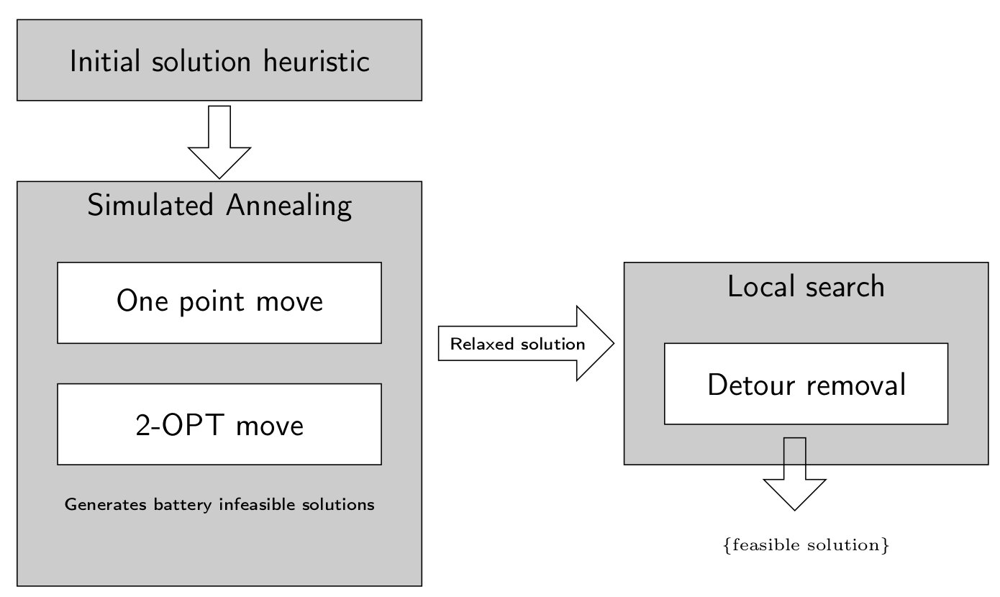

# Electrical Vehicule Routing Problem with time windows and capacitated stations Metaheuristic

Project developed for a university course on "Methods and Models for Decision Support".

## Problem statement

Finds feasible solutions in reasonnable time to the EVRPTW problem.
This problem is defined as a vehicle routing problem in which the following constraints hold :
- Single depot
- Time windows [release date, deadline] and service times
- Capacitated vehicles
- Electrical vehicles implying detours to be planned to charging stations
- Capacitated charging stations (limited number of plugs)
- FIFO recharging stations
- Maximum battery capacity

Objective : minimizing the overall travelled distance

## Implemented solver

- Simulated Annealing generating relaxed solutions with respect to the battery constraint (one-point move and 2-OPT move)
- Local search for charging detours insertion

